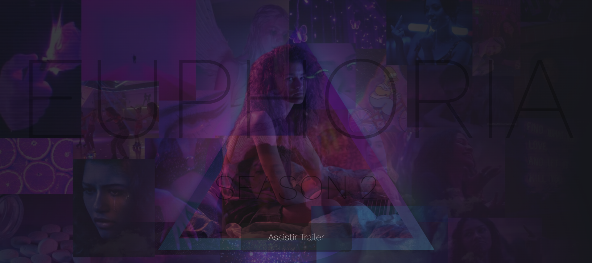

<h1>Landing Page -Euphoria Season 2 </h1>
<h4>Criação de uma landing page promovendo a segunda temporada de euphoria HTML|CSS</h4>
<h2>Tecnologias Utilizadas</h2>

  
  
 

<h2>Preview</h2>

<h4  style="display: inline_block">Visualização do site :</h4><a style="display: inline_block" target="blank" href="https://euphoriaseason2.netlify.app/">Preview no Netlify</a>
